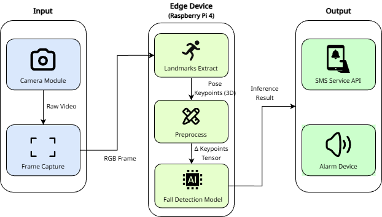

# 📌 Project Title

> ### **Fall Detection System**

<br><br>


## 📖 Overview


<br><br>
This system is designed to rapidly detect falls, especially among the elderly population, and immediately notify caregivers to enable prompt response and intervention.
Unlike typical vision-based approaches, it detects falls **without any wearable sensors**, using only a camera module.
The system extracts skeleton keypoints and treats them as time-series data, similar to gyroscope readings, enabling fall detection through temporal analysis rather than standard image classification.
A functional prototype was implemented and deployed on a Raspberry Pi for real-world demonstration.
To ensure real-time performance on resource-constrained hardware, the system adopts a multi-threaded architecture to reduce processing bottlenecks and latency.

<br><br>

## 📄 Undergraduate Thesis
- **Title**: Fall Detection System Based on a GRU Model
- **Author**: Jun-Yong Kwon, Minha Lee, Hyun-Seok Jung
- **Degree**: Bachelor’s Thesis  
- **Description**: This project is based on my undergraduate thesis focusing on real-time fall detection using skeleton-based time-series analysis optimized for edge devices.  
- **Thesis PDF**: [Download](./docs/Fall_Detection_Thesis.pdf)

<br><br>

## 🧩 Data Preprocessing

* **Dataset**: 3,782 human motion video samples
* **Challenge**: Detecting falls using **only computer vision** (no physical sensors) was difficult
* **Inspiration**: Adopted the concept of **gyroscope data** from wearable devices to capture motion patterns
* **Skeleton Extraction**:

  * Used `MediaPipe Pose` to estimate human body keypoints
  * Each joint represented by its **X, Y, Z coordinates** in 3D space
  * Skeleton data served as a **sensor-like input** for the model

<br><br>

## 🤖 Model Training

* **Data Type**: Sequences of coordinates (X, Y, Z) for each keypoint.

* **Model Choice**:

  * Started with a **LSTM** model for sequence modeling.
  * During deployment on a **Raspberry Pi**, inference speed was found to be slow.
  * Switched to **GRU**, which provided faster inference with similar performance.

* **Why this model**:
  RNN-based architectures (LSTM/GRU) work well for recognizing temporal patterns in skeleton-based motion data.
  Although Transformer-based models and ARIMA could be considered as alternative approaches, Transformer models were not selected due to their large model size and high computational overhead, which make them unsuitable for deployment on edge devices.
  ARIMA models were also excluded because they are limited in modeling nonlinear dynamics and are not well-suited for handling high-dimensional or multivariate input data in this application.

<br>


* Through a comparative performance analysis of MLP, LSTM, and GRU models, the GRU model demonstrated the best test performance.
  Based on the F1 score evaluated on approximately 300 test samples:

  * MLP: **0.887**
  * LSTM: **0.923**
  * **GRU: 0.952**


* To enable fast inference on edge devices, the model was converted to TorchScript for deployment.
  On an Intel(R) Core(TM) i5-14400F (2.50 GHz) CPU:

  * Original model inference time: **0.123 s**
  * TorchScript model inference time: **0.0746 s**
    → Demonstrating a significant improvement in inference speed.

<br><br>

## 🛠️ Tech Stack

| Category    | Tools / Frameworks               |
| ----------- | -------------------------------- |
| OS          | Windows 11 HOME, Raspberry Pi OS |
| Language    | Python 3.8                       |
| Framework   | PyTorch                          |
| Environment | Jupyter Notebook / VSCode        |
| Hardware    | NVIDIA RTX 4060, Raspberry Pi 4  |

<br><br>

## 📂 Project Structure

```bash
.
│   # Preprocessing
├── Data_Preprocessing.ipynb              # Data Preprocessing
├── Extract_skeleton.py                   # Extract skeleton landmarks from video frames
├── Labeling.ipynb                        # Labeling for fall detection
├── Merging_Data.py                       # Merge multiple datasets
│ 
│   # Model Training
├── Fall_Detection.ipynb                  # Notebook for training and evaluation
├── Fall_Detection_Hyperparameter_Tuning.py  # Hyperparameter Tuning Pipeline
├── Fall_Detection_Training.py            # Model Training Pipeline
│
│   # Serving
├── Fall_Detector.py                      # Edge Device Inference Script
└── [...]
```

<br><br>

## 💡 Install Dependency

```bash
pip install -r requirements.txt
```

<br><br>

## 📚 References

1. Jin-Il Kim. (2022). Development of a Fall Detection System Based on Hospital Inpatients Data Using Radar, *Journal of Knowledge Information Technology and System*, Vol. 17, No. 2, pp. 375-384.
2. Miguel Piñeiro, David Araya, David Ruete, & Carla Taramasco. (2024). Low-Cost LIDAR-Based Monitoring System for Fall Detection, *IEEE Access*, Vol. 12, pp. 72051-72061.
